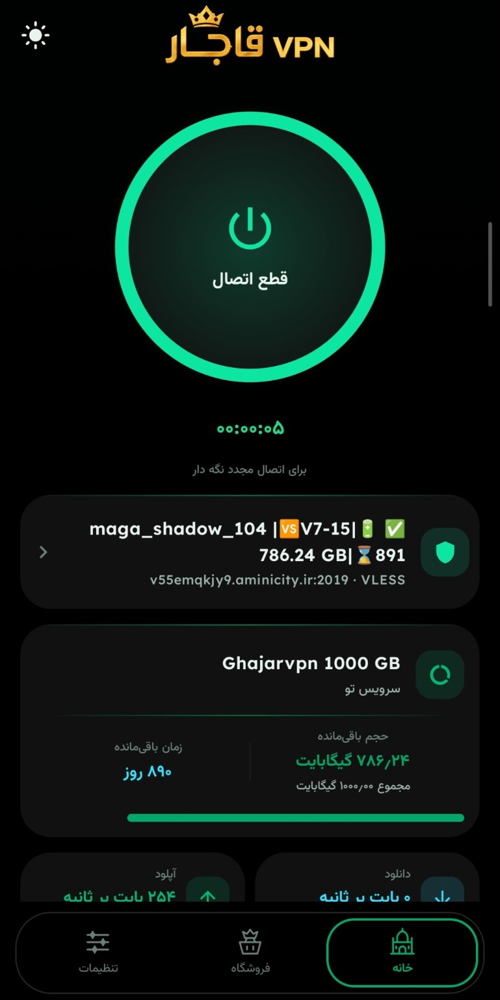
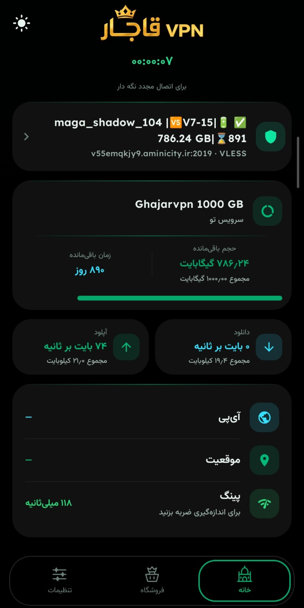
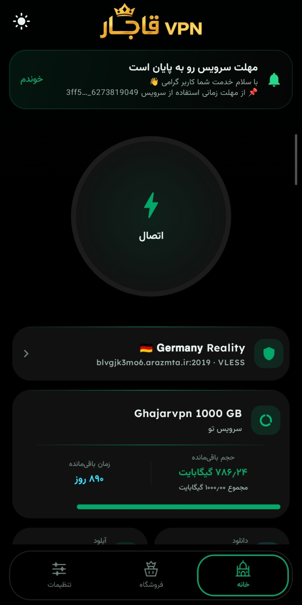
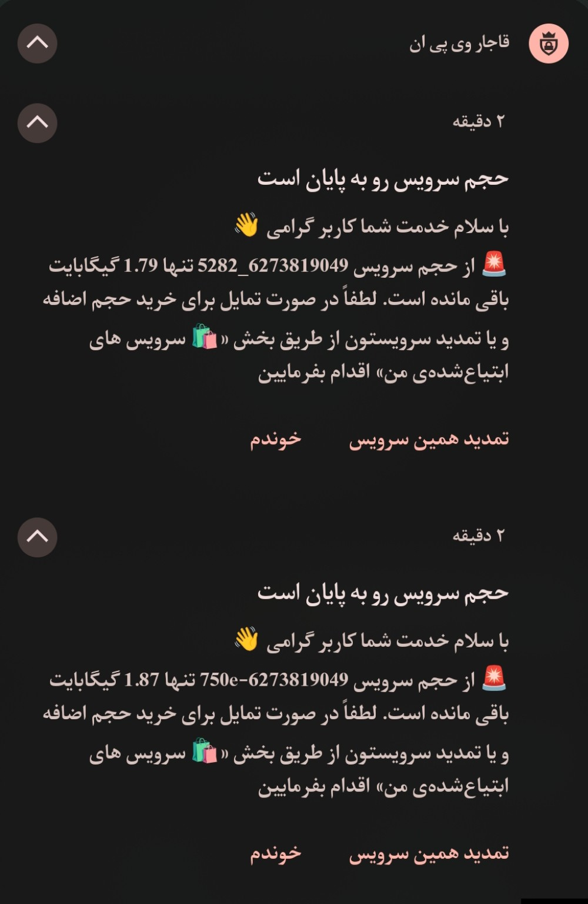
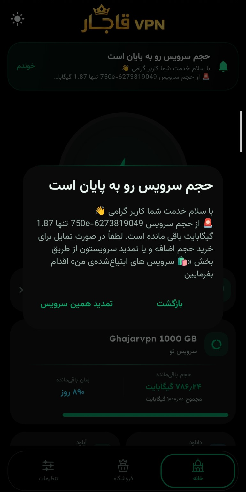

<div align="center">


# قاجار VPN · Ghajar VPN

**اتصال چند‌هسته‌ای، مدیریت کانفیگ، خرید سرویس و تمدید در یک مجموعه**


[فارسی](README-fa.md) · [English](README-en.md) · [العربية](README-ar.md) · [Русский](README-ru.md)

[دانلود نسخهٔ ۱.۱.۲](https://github.com/meysam82003/Ghajarvpn-/releases/tag/1.1.2) · [یادداشت نسخه](docs/release-notes/v1.1.2.md) · [کانال](https://t.me/Ghajarvpn) · [ربات و مینی‌اپ](https://t.me/Ghajar_vpnbot)

</div>

<div dir="rtl">

قاجار یک مجموعه برای دو کار مرتبط است: اتصال با کانفیگ‌ها و موتورهای سازگار، و مدیریت سرویس‌هایی که از فروشگاه خریداری شده‌اند. نسخهٔ اندروید رابط بومی Kotlin/Compose دارد؛ نسخه‌های کامپیوتر به موتورهای محلی و رابط فروشگاه مجهز شده‌اند. روی آیفون، آیپد و تلویزیون ال‌جی، خروجی فعلی برای **خرید و مدیریت سرویس** است. امکانات هر دستگاه را باید از جدول همان پلتفرم خواند؛ وجود نام یک دستگاه در این پروژه به معنی یکسان‌بودن همهٔ موتورهای آن نیست.

این معرفی در **۸ اکتبر ۲۰۲۶** بر اساس کد `main` و فایل‌های موجود در انتشار **۱.۱.۲** بازبینی شده است. منبع نسخه‌های کامپیوتر و وب هنوز در شاخهٔ جداگانه قرار دارد؛ مسیرهای دقیق و مبنای هر ادعا در [سند شواهد](docs/README_EVIDENCE.md) آمده است. چهار زبان این صفحه، زبان‌های مستندات هستند؛ رابط اندروید در کد فعلی فارسی و انگلیسی دارد.

## دستگاه‌ها و دانلود مستقیم

| دستگاه | فایل انتشار ۱.۱.۲ | کاربرد واقعی و نکتهٔ نصب |
|---|---|---|
| گوشی و تبلت اندروید ARM64 | [APK 64-bit](https://github.com/meysam82003/Ghajarvpn-/releases/download/1.1.2/Ghajarvpn-1.1.2-arm64-v8a.apk) | کلاینت VPN و فروشگاه؛ Android 8.0 به بالا |
| اندروید ARMv7 | [APK 32-bit](https://github.com/meysam82003/Ghajarvpn-/releases/download/1.1.2/Ghajarvpn-1.1.2-armeabi-v7a.apk) | برای دستگاه‌های ARM با معماری ۳۲ بیتی؛ Android 8.0 به بالا |
| Android TV / باکس ARM64 | [TV APK 64-bit](https://github.com/meysam82003/Ghajarvpn-/releases/download/1.1.2/GhajarVPN-AndroidTV-arm64-v8a.apk) | برنامهٔ اندروید قابل نصب روی TV؛ فایل از خروجی `preview` تهیه شده است |
| Android TV / باکس ARMv7 | [TV APK 32-bit](https://github.com/meysam82003/Ghajarvpn-/releases/download/1.1.2/GhajarVPN-AndroidTV-armeabi-v7a.apk) | همان مسیر، با معماری ۳۲ بیتی؛ انتخاب فایل باید مطابق پردازنده باشد |
| Windows x64 | [نصاب EXE](https://github.com/meysam82003/Ghajarvpn-/releases/download/1.1.2/GhajarVPN-win-x64.exe) | نسخهٔ نصبی دسکتاپ با موتور اتصال محلی و فروشگاه |
| macOS / MacBook با Apple silicon | [DMG arm64](https://github.com/meysam82003/Ghajarvpn-/releases/download/1.1.2/GhajarVPN-mac-arm64.dmg) | برای مک‌های دارای پردازندهٔ Apple silicon |
| macOS / MacBook اینتل | [DMG x64](https://github.com/meysam82003/Ghajarvpn-/releases/download/1.1.2/GhajarVPN-mac-x64.dmg) | برای مک‌های اینتل؛ فایل آن از نسخهٔ Apple silicon جداست |
| Linux x86_64 | [AppImage](https://github.com/meysam82003/Ghajarvpn-/releases/download/1.1.2/GhajarVPN-linux-x86_64.AppImage) | برنامهٔ دسکتاپ؛ پس از دادن اجازهٔ اجرا باز می‌شود |
| iPhone / iPad | [پروفایل mobileconfig](https://github.com/meysam82003/Ghajarvpn-/releases/download/1.1.2/GhajarVPN-iPhone.mobileconfig) | میان‌بر تمام‌صفحهٔ فروشگاه روی Home Screen؛ **فاقد موتور VPN داخلی** |
| تلویزیون LG webOS | [بستهٔ IPK](https://github.com/meysam82003/Ghajarvpn-/releases/download/1.1.2/GhajarVPN-webos.ipk) | ورود به فروشگاه وب در حالت TV؛ **فاقد تونل VPN داخلی**؛ نصب با Developer Mode |

روی اندروید، معماری فایل باید با دستگاه تطبیق داشته باشد. APK تلویزیون از بیلد preview آمده و ممکن است امضای آن با APK رسمی گوشی یکسان نباشد. این خروجی، همان برنامهٔ اندروید برای دستگاه TV است و وجود آن ادعای آزمون تمام مدل‌های تلویزیون و تمام ریموت‌ها نیست.

در ویندوز نصاب را اجرا کنید. در مک فایل DMG را باز کنید و برنامه را به Applications ببرید. خروجی فعلی دسکتاپ گواهی امضای توسعه‌دهنده ندارد و سیستم‌عامل ممکن است هنگام اولین اجرا تأیید بخواهد. در لینوکس می‌توان از تنظیمات فایل اجازهٔ اجرا داد یا `chmod +x GhajarVPN-linux-x86_64.AppImage` را اجرا کرد. حالت تونل کامل دسکتاپ به دسترسی مدیر سیستم نیاز دارد.

فایل آیفون را با Safari دریافت کنید و از Settings، بخش Profile Downloaded نصب کنید. این پروفایل یک Web Clip قابل حذف می‌سازد؛ پروفایل اتصال VPN نیست. برای استفاده از سرویس خریداری‌شده روی iOS، کانفیگ را در کلاینت سازگار نصب‌شده روی دستگاه وارد کنید. بستهٔ ال‌جی نیز فروشگاه را باز می‌کند و به‌خودی‌خود اینترنت تلویزیون را تونل نمی‌کند. نصب IPK از مسیر Developer Mode و ابزارهایی مانند webOS Dev Manager یا `ares-install` انجام می‌شود.

## تصاویر واقعی برنامه

تصاویر زیر مستقیماً از عکس‌های ارسالی کاربر آمده‌اند. پوستر بالای صفحه اثر تبلیغاتی است؛ این گالری، رابط واقعی اندروید، مصرف سرویس و مسیر تمدید را نشان می‌دهد. نام سرور، پینگ، حجم و روزهای نمایش‌داده‌شده متعلق به همان حساب و لحظهٔ ثبت تصویر هستند و مشخصات ثابت محصول یا وعدهٔ طرح فروش محسوب نمی‌شوند.

<table>
  <tr>
    <td align="center"><br><b>اتصال و سرویس فعال</b></td>
    <td align="center"><br><b>حجم، زمان و ترافیک</b></td>
    <td align="center"><br><b>یادآوری مهلت سرویس</b></td>
  </tr>
  <tr>
    <td align="center"><br><b>تمدید از نوار اعلانات</b></td>
    <td align="center"><br><b>تمدید داخل برنامه</b></td>
    <td align="center"><b>خانه · فروشگاه · تنظیمات</b><br>قالب تیره، نشان طلایی و رنگ سبز قاجار<br>تصاویر بدون ساختن رابط خیالی</td>
  </tr>
</table>

## تجربهٔ روزمره روی اندروید

صفحهٔ اصلی وضعیت اتصال، سرور انتخاب‌شده، پروتکل و مدت نشست را کنار اطلاعات سرویس نشان می‌دهد. اگر اشتراک اطلاعات حجم و تاریخ انقضا را ارائه کند، مقدار باقی‌مانده و زمان در کارت سرویس نمایش داده می‌شوند. دریافت این اطلاعات به پاسخ اشتراک یا پنل مربوط وابسته است؛ برای یک کانفیگ معمولی بدون اطلاعات سهمیه، برنامه نباید عدد ساختگی نشان دهد.

از فهرست سرورها می‌توان گروه‌ها و علاقه‌مندی‌ها را مدیریت کرد، اطلاعات پروفایل را دید، پینگ و آزمون اتصال را اجرا کرد و انتخاب خودکار سرور را به کار گرفت. نتیجهٔ تست، وضعیت همان سرور و شبکه در زمان اندازه‌گیری است. سرور رایگان یا کانفیگ واردشده ممکن است منقضی شود، از دسترس خارج شود یا در یک اپراتور جواب ندهد؛ انتخاب خودکار نمی‌تواند یک سرور خراب را به سرویس فعال تبدیل کند.

رصدخانهٔ قاجار در ۱.۱.۲ بازطراحی شده است: نمایش سرعت، دانلود و آپلود، ترافیک نشست و داده‌هایی از باتری، دما، CPU و حافظه در آن جمع شده‌اند. در بخش‌های تشخیصی، جزئیات سرور، تاریخچهٔ رویدادها، تست سرعت و کیفیت، لاگ و ابزارهای شبکه برای بررسی اتصال در دسترس‌اند. مقدار قابل نمایش هر حسگر به اطلاعاتی بستگی دارد که خود دستگاه و سیستم‌عامل فراهم می‌کنند.

## موتورهای اتصال و پروتکل‌ها

قاجار پروفایل را به موتور مناسب می‌فرستد. پروتکل، موتور، روش انتقال و قالب فایل چهار مفهوم جدا هستند؛ خواندن یک فایل به‌تنهایی تضمین نمی‌کند موتور لازم در آن بیلد حاضر باشد.

| مسیر در کد اندروید ۱.۱.۲ | نمونهٔ قابلیت‌های پیاده‌سازی‌شده | شرط استفاده |
|---|---|---|
| Xray | VLESS، VMess، Trojan، Shadowsocks، SOCKS، HTTP، Hysteria2، WireGuard؛ REALITY، XHTTP، WS، gRPC، HTTPUpgrade و KCP | کانفیگ و سرور سازگار؛ گزینه‌ها وابسته به پروتکل‌اند |
| sing-box | TUIC، Hysteria 1، AnyTLS، SSH، Snell، OpenConnect، NaiveProxy و ShadowTLS | باینری و تنظیمات لازم باید در بیلد حاضر باشند |
| sing-box با helper | AmneziaWG، Mieru، Brook، SSTP و SoftEther؛ روش‌های مختلف تونل SSH | مسیر helper و پارامترهای همان پروتکل لازم‌اند |
| OpenVPN | ورود `.ovpn` و مسیر اختصاصی اتصال | گواهی، کلید یا نام کاربری/رمز مطابق نیاز سرور |
| IKEv2 / IPsec | ماژول strongSwan و پروفایل IKEv2 | حساب، گواهی و تنظیمات سازگار |
| Psiphon | موتور داخلی و تنظیمات انتخاب پروتکل تونل | دسترسی شبکه و در دسترس‌بودن سرویس |
| Tor | موتور Tor و تنظیمات پل‌ها | پل معتبر و اجزای انتقال مربوط |
| Aether | مسیر MASQUE / WARP | در کد با وضعیت آزمایشی عرضه می‌شود |

فهرست بالا وجود مسیر در کد را بیان می‌کند؛ تأیید اتصال همهٔ این روش‌ها روی همهٔ گوشی‌ها نیست. جزئیات قابلیت موتور و نبودن باینری از مسیر مدیریت هسته گزارش می‌شود. برای تونل‌ها و روش‌های خاص باید همان پروفایل، بیلد و شبکه بررسی شوند.

در اپ اصلی سبک، **DNSTT، VayDNS، NoizDNS، Slipstream، MasterDNS، StormDNS، CottenDNS و Juicity مسیر اتصال فعال ندارند**. بعضی پروفایل‌های آن‌ها برای ویرایش، پشتیبان و انتقال حفظ می‌شوند؛ این حفظ اطلاعات را نباید پشتیبانی از اتصال معرفی کرد. PPTP و L2TP/IPsec نیز در این معرفی به‌عنوان اتصال آماده تبلیغ نمی‌شوند. گزارش‌های مراحل قدیمی ممکن است هسته‌هایی را فهرست کنند که بعداً از APK پایه حذف شده‌اند.

## ورود و مدیریت کانفیگ

ورود از لینک، کلیپ‌بورد، QR، فایل و اشتراک انجام می‌شود. لینک‌های سازگار، JSON مربوط به Xray یا sing-box، YAML سازگار Clash، فایل WireGuard و پروفایل OpenVPN مسیرهای مشخص دارند. برنامه فایل Clash را به پروفایل‌های قابل استفاده تبدیل می‌کند؛ این به معنی وجود موتور مستقل Mihomo/Clash یا پشتیبانی از تمام قواعد یک فایل Clash نیست.

پروفایل کامل sing-box با قالب `.bpf` نیز مسیر ورود دارد. دربارهٔ NPVT/NPVS باید نوع فایل را در نظر گرفت: نسخهٔ خوانا و بعضی حالت‌های دارای رمز کاربر قابل پردازش‌اند، ولی نسخهٔ قفل‌شده با کلید اختصاصی سازنده یا قفل گیرنده/دستگاه، واردشدن عمومی ندارد. برنامه برای این حالت‌ها وضعیت قفل یا عدم پشتیبانی می‌دهد. ادعای «بازکردن همهٔ فایل‌های رمزدار» در این پروژه درست نیست.

گروه‌بندی اشتراک‌ها، به‌روزرسانی فهرست سرورها، فرم افزودن و ویرایش پروفایل و انتقال کانفیگ، کارهای معمول مدیریت را پوشش می‌دهند. سازگاری خروجی با دستگاه دیگر به پروتکل و کلاینت مقصد وابسته است؛ فایل اختصاصی قاجار الزاماً در کلاینت دیگری خوانده نمی‌شود.

## فروشگاه، حساب و سرویس‌های خریداری‌شده

فروشگاه به بک‌اند قاجار، ربات تلگرام و مینی‌اپ متصل است. طرح‌ها و قیمت‌ها از پنل می‌آیند. خرید سرویس، دریافت تست در صورت عرضه، کیف پول، رسید شارژ، کد تخفیف، فروشگاه‌های همکار، خدمات حساب و مسیر پشتیبانی در این مجموعه وجود دارند؛ موجودبودن هر گزینه به تنظیمات و پاسخ فروشگاه مربوط وابسته است.

سرویس خریداری‌شده می‌تواند به فهرست اشتراک‌ها اضافه شود و سرورهای هر سرویس در گروه جدا دیده شوند. برای سرویسی که اطلاعات مبدأ خرید را دارد، دکمهٔ تمدید به همان سرویس ارجاع می‌دهد. خرید حجم اضافه یا تمدید نیز باید از گزینه‌هایی انجام شود که پنل برای آن سرویس ارائه کرده است. بازگشت از درگاه به‌تنهایی اثبات پرداخت نیست؛ نتیجه با پاسخ سرور بررسی می‌شود.

در حالت اختلال یا آفلاین، مسیر خطای فروشگاه برای نمایش پیام قابل فهم طراحی شده و نام میزبان در خطای کاربر پنهان می‌شود. سرویس فروشگاه به دسترسی به بک‌اند نیاز دارد؛ صفحهٔ آفلاین به معنی خرید یا تأیید پرداخت بدون اینترنت نیست. اتصال VPN و فعال‌بودن فروشگاه دو وضعیت جدا هستند.

## اعلان واقعی، با مسیر تمدید همان سرویس

هشدار کم‌شدن حجم و نزدیک‌شدن پایان مهلت فقط متن داخل اپ نیست. در اندروید، اعلان در نوار اعلانات گوشی هم نمایش داده می‌شود. دکمهٔ **«تمدید همین سرویس»** درخواست تمدید را برای شناسهٔ همان سرویس به فروشگاه می‌فرستد؛ دکمهٔ **«خوندم»** نیز مسیر ثبت خوانده‌شدن اعلان را دارد. همین پیام می‌تواند در بنر صفحهٔ اصلی و پنجرهٔ داخل برنامه دیده شود، مانند تصاویر بالا.

اعلان اتصال اطلاعات نشست و ترافیک را نمایش می‌دهد و در ۱.۱.۲ دکمهٔ پینگ، نمایش جداگانهٔ دانلود/آپلود و اعلان «اتصال» پس از قطع اضافه شده‌اند. ویجت صفحهٔ اصلی نیز برای دسترسی سریع وجود دارد. اعلان‌های فروشگاه به حساب متصل، پاسخ سرور، مجوز اعلان و تنظیمات کانال‌ها وابسته‌اند؛ محدودیت پس‌زمینهٔ سیستم‌عامل می‌تواند زمان دریافت را تغییر دهد.

روی دسکتاپ، برنامه از اعلان بومی و آیکن سینی سیستم استفاده می‌کند و مسیر شروع همراه سیستم در آن وجود دارد. روی iOS و webOS نباید رفتار اعلان پس‌زمینهٔ اندروید را وعده داد؛ Web Clip آیفون به‌تنهایی تحویل اعلان بسته‌بودن اپ را تضمین نمی‌کند. Web Push به پشتیبانی دستگاه، نصب وب‌اپ، اجازهٔ کاربر و تنظیمات سمت سرور وابسته است.

## اشتراک قاجار و اشتراک اتصال گوشی

در **ساخت اشتراک قاجار (GVPN)** می‌توان کانفیگ‌های قابل اشتراک را انتخاب کرد، نام و توضیح داد و محدودیت زمان/حجم و رمز اختیاری تعیین کرد. فایل خروجی فعلی `.gsb2` است. گیرنده آن را به‌صورت گروه جدا وارد می‌کند؛ مصرف در برنامه محاسبه می‌شود و در ۵۰، ۲۵ و ۱۰ درصد باقی‌مانده مسیر هشدار وجود دارد. با تمام‌شدن سهمیه یا زمان، مسیر توقف اتصال و حذف گروه دریافتی اجرا می‌شود. رابط گزینه‌های آماده از ۱۰ دقیقه و ۱ مگابایت، مقدار سفارشی و حالت بدون محدودیت دارد.

این محدودیت، **محلی و مربوط به دستگاه گیرنده** است. تقسیم یک اکانت ۲۰ گیگابایتی به چهار سهمیهٔ سراسری پنج‌گیگابایتی، با شمارندهٔ محلی فایل تضمین نمی‌شود؛ برای سهمیهٔ مشترک واقعی بین دستگاه‌ها باید پنل/سرور آن را اعمال کند. سهمیهٔ فایل با حجم تجاری سرویس در فروشگاه یکی نیست. اطلاعات اشتراک محدودشده نیز مانند کانفیگ معمولی برای خروجی مجدد ارائه نمی‌شوند.

اشتراک اتصال گوشی مسیر دیگری است: دستگاه مقصد به شبکهٔ محلی/هات‌اسپات و پراکسی معرفی‌شده متصل می‌شود. در کد فعلی، این مسیر برای نشست‌های سازگار با Xray و موتورهایی که از آن عبور می‌کنند در نظر گرفته شده است. اتصال OpenVPN یا IKEv2 و حالت فقط‌پراکسیِ نامناسب، درگاه اشتراک یکسان ندارند. این قابلیت را نباید «انتقال همهٔ ترافیک هر دستگاه با هر موتور» توصیف کرد.

صفحهٔ مستقل صندوق امن و پورتال اشتراک قدیمی در رابط ۱.۱.۲ معرفی نمی‌شوند؛ وجود فایل‌ها یا اسناد قدیمی آن‌ها، دلیل فعال‌بودن همان رابط در نسخهٔ فعلی نیست.

## شخصی‌سازی، پروکسی برنامه‌ها و پشتیبان

ویزارد شروع، تم‌های آماده، رنگ‌ها، پیش‌نمایش مدل‌های دکمهٔ اتصال و نوار پایین، و تنظیمات چیدمان، ظاهر برنامه را قابل تغییر می‌کنند. خانه، فروشگاه و تنظیمات، مسیرهای اصلی رابط‌اند. فارسی راست‌به‌چپ و انگلیسی در کد اندروید وجود دارند.

پروکسی برنامه‌ها تا **۱۰ پروفایل نام‌دار** برای انتخاب برنامه‌های «بدون VPN» یا «فقط با VPN» دارد. اجرای دقیق این انتخاب به موتور و حالت اتصال مربوط است. پشتیبان‌گیری امکان انتخاب بخش‌ها را فراهم می‌کند؛ اشتراک‌های محدودشدهٔ دریافتی مانند کانفیگ معمولی در خروجی پشتیبان قرار نمی‌گیرند.

در manifest اصلی، درخواست مجوز دوربین برای QR و مجوز اعلان وجود دارد؛ مجوزهای مکان و ضبط صدا از manifest ادغام‌شده حذف می‌شوند. مجوزهای فنی شبکه، سرویس VPN و نصب بروزرسانی با این مجوزهای تعاملی فرق دارند.

## نسخه‌های کامپیوتر

نسخه‌های Windows، macOS و Linux در بستهٔ دسکتاپ موتورهای محلی دارند. در کد این بسته مسیر پراکسی محلی، پراکسی سیستم، تونل کل دستگاه و انتخاب برنامه‌ها پیاده‌سازی شده است. تونل و حالت انتخاب برنامه به sing-box و دسترسی مدیر نیاز دارند؛ موتور یا helper غایب در یک بیلد، نباید به‌عنوان قابلیت حاضر نمایش داده شود. بعضی اجزا مانند Tor، Aether یا Slipstream در workflow به‌صورت اختیاری ساخته می‌شوند.

فروشگاه، حساب، سرویس‌ها و اعلان‌ها در کنار اتصال قرار دارند. پوستهٔ دسکتاپ رابط PWA را در پنجرهٔ برنامه باز می‌کند و اجزای اتصال به‌صورت محلی اجرا می‌شوند. ظاهر و معماری آن با رابط بومی Compose اندروید کاملاً یکسان نیست. فهرست کامل هسته‌های اندروید را نباید بدون بررسی به همهٔ بسته‌های دسکتاپ تعمیم داد.

## بروزرسانی و تاریخچهٔ نسخه‌ها

نسخهٔ اندروید مسیر بررسی بروزرسانی، نمایش تاریخچهٔ انتشار، دانلود APK متناسب با ABI، تطبیق SHA-256 و بررسی گواهی امضا با نصب موجود را دارد. نبود چک‌سام یا عدم تطابق امضا باید به‌صورت نتیجهٔ قابل فهم گزارش شود. این بررسی‌ها مربوط به مسیر بروزرسانی اندروید هستند؛ فایل `SHA256SUMS.txt` فعلیِ انتشار صرفاً دو APK گوشی را پوشش می‌دهد و نباید به‌عنوان چک‌سام همهٔ نصاب‌های دسکتاپ معرفی شود.

از [یادداشت ۱.۱.۲](docs/release-notes/v1.1.2.md) برای تغییرات این نسخه و از [فهرست انتشارها](https://github.com/meysam82003/Ghajarvpn-/releases) برای فایل‌های نسخه‌های قبل استفاده کنید. جایگزینی نصب موجود به package name و امضای سازگار نیاز دارد.

## ساخت از سورس و ساختار مخزن

برای ساخت اندروید، مطابق workflow فعلی، JDK 17، Android SDK 36، build-tools 36.0.0، NDK `28.2.13676358` و ابزارهای بومی مورد نیازند:

```bash
./gradlew :app:assembleDebug
```

| مسیر | محتوا |
|---|---|
| `app/` | رابط بومی اندروید، مدیریت اتصال، حساب و فروشگاه |
| `browser/` | مرورگر داخلی و ابزارهای مرتبط |
| `openvpn/` و `strongswan/` | ماژول‌های OpenVPN و IKEv2 |
| `native/` و `third_party/` | سورس/اطلاعات موتورهای بومی و مجوزهای آن‌ها |
| `backend/Faoxima-1.0.0/` | پنل، API، ربات و مینی‌اپ |
| `docs/` | گزارش‌های فنی، یادداشت نسخه و شواهد معرفی |
| `assets/` | نشان، پوستر جدید و تصاویر واقعی |

سورس بسته‌های دسکتاپ، آیفون و webOS در مبنای بررسی‌شدهٔ شاخهٔ جدا موجود است؛ [سند شواهد](docs/README_EVIDENCE.md) به فایل‌های همان commit لینک می‌دهد. این تغییر مستندات، آن سورس را به `main` ادغام نمی‌کند و نسخهٔ جدیدی از برنامه نمی‌سازد. کلید امضای انتشار باید بیرون Git یا در Secrets نگهداری شود.

## مجوزها و ارتباط

مجوز پروژه و تعهدات هر جزء در [LICENSE](LICENSE)، [THIRD_PARTY_NOTICES.md](THIRD_PARTY_NOTICES.md) و [مجوز هسته‌ها](docs/THIRD_PARTY_CORE_LICENSES.md) ثبت شده‌اند. OpenVPN و سایر موتورهای بالادستی شرایط خود را دارند؛ یک برچسب واحد جایگزین آن‌ها نیست.

[کانال قاجار](https://t.me/Ghajarvpn) · [ربات و مینی‌اپ قاجار](https://t.me/Ghajar_vpnbot) · [گزارش مشکل](https://github.com/meysam82003/Ghajarvpn-/issues)

</div>
