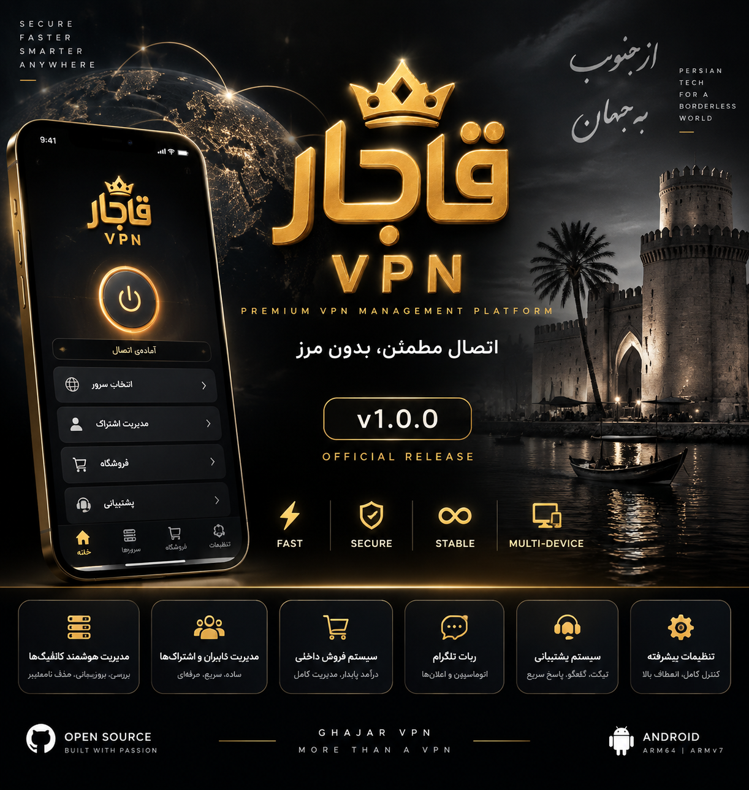

<div align="center">




# 👑 Ghajar VPN

### Premium VPN Management Platform

**مدیریت هوشمند سرویس، فروش، کاربران و اتصال‌های VPN**


[فارسی](README-fa.md) · [Telegram channel](https://t.me/Ghajarvpn) · [Telegram bot](https://t.me/Ghajar_vpnbot)

</div>

---

## 🚀 معرفی

**Ghajar VPN** یک پلتفرم برای مدیریت و ارائه سرویس‌های VPN است که اپلیکیشن اندروید، مدیریت اشتراک‌ها، فروش سرویس، اعلان‌ها و ابزارهای ارتباط با کاربران را در بر می‌گیرد. رابط برنامه با Kotlin/Compose و پشتیبانی از زبان فارسی و چیدمان راست‌به‌چپ توسعه داده شده است.

---

## ✨ امکانات

| بخش | توضیحات |
|---|---|
| 🔐 اتصال VPN | VLESS، VMess، Trojan، Shadowsocks، SOCKS، HTTP، Hysteria2، WireGuard و IKEv2 |
| 🌐 OpenVPN | هسته یکپارچه و ورود فایل `.ovpn`، احراز هویت و بررسی پینگ پیش از اتصال |
| 👤 کاربران و اشتراک‌ها | مدیریت حساب، سرویس و واردکردن کانفیگ و لینک اشتراک |
| 💳 فروشگاه | فروشگاه بومی متصل به پنل مینی‌اپ و پرداخت HTTPS درون‌برنامه‌ای |
| 📦 تحویل سرویس | واردکردن خودکار اشتراک و کانفیگ تحویل‌داده‌شده |
| 🔔 اعلان‌ها | اعلان‌های عمومی، شخصی، شناور، حجم، انقضا و وضعیت اتصال |
| 🛡️ امنیت و اتصال | نمایش پینگ و کنترل قطع اتصال از اعلان برنامه |
| 🎨 رابط کاربری | طراحی اختصاصی، پشتیبانی از RTL و هویت بصری سرمه‌ای، سبز زمردی، آبی یخی و طلایی |

> این جدول امکانات توصیف‌شده در سورس را معرفی می‌کند؛ تأیید عملکرد هر قابلیت به تست روی دستگاه و سرویس واقعی نیاز دارد.

---

## 🏗 ساختار پروژه

```text
app/                    Android application and native store
openvpn/                Integrated OpenVPN library
strongswan/             IKEv2 engine
browser/                Embedded browser module
native/Aether/          Native engine source
native/Psiphon/         Native engine source
backend/Faoxima-1.0.0/  Backend, panel, bot and mini-app
assets/                  Repository banner and logo
docs/                    Documentation and branding assets
```

**سورس اصلی و مستقل پروژه در شاخه `main` قرار دارد.** ساخت فعلی مستقیماً از همین مخزن انجام می‌شود و نیازی به کلون upstream، اعمال پچ‌های قدیمی یا بازسازی پروژه در CI ندارد. شرح منشأ و خط‌مشی حفاظت از نسخه تاریخی در [SOURCE-POLICY.md](SOURCE-POLICY.md) آمده است.

---

## 🛠 تکنولوژی‌ها و ساخت

- Kotlin، Jetpack Compose و Android SDK
- Android 8.0 به بالا (API 26، مطابق هسته AAR موجود)
- JDK 17، Android SDK 36 و Build Tools 36.0.0
- NDK `27.3.13750724` و ابزارهای SWIG و ninja-build

```bash
./gradlew :app:assembleDebug
```

جزئیات دقیق CI در [Android workflow](.github/workflows/android.yml) و مستندات فارسی در [README-fa.md](README-fa.md) موجود است. امضای انتشار از Secretهای CI یا فایل محلی ثبت‌نشده `keystore.properties` خوانده می‌شود؛ کلید امضا را هرگز در مخزن Commit نکنید.

---

## 🛣 Roadmap

| نسخه/مرحله | وضعیت | شرح |
|---|---|---|
| `1.0.0` | نسخه تاریخی منتشرشده | فایل‌های این Release و تگ آن باید بدون تغییر باقی بمانند. |
| توسعه بعدی | برنامه‌ریزی/در دست توسعه | VPN Share، آپدیت درون‌برنامه‌ای، تمدید اشتراک، آمار مصرف و بکاپ کامل؛ تا زمان تست و انتشار، قابلیت آماده تلقی نشوند. |

[مشاهده Release 1.0.0](https://github.com/meysam82003/Ghajarvpn-/releases/tag/1.0.0)

---

## 📄 License

این پروژه مشتق، مجوزهای بالادستی را حفظ می‌کند؛ OpenVPN for Android تحت GPLv2 و شرایط تکمیلی آن ارائه شده است. برای جزئیات به [LICENSE](LICENSE)، [THIRD_PARTY_NOTICES.md](THIRD_PARTY_NOTICES.md) و `openvpn/doc/LICENSE.txt` رجوع کنید.

<div align="center">

Made with ❤️ for Ghajar VPN

</div>
